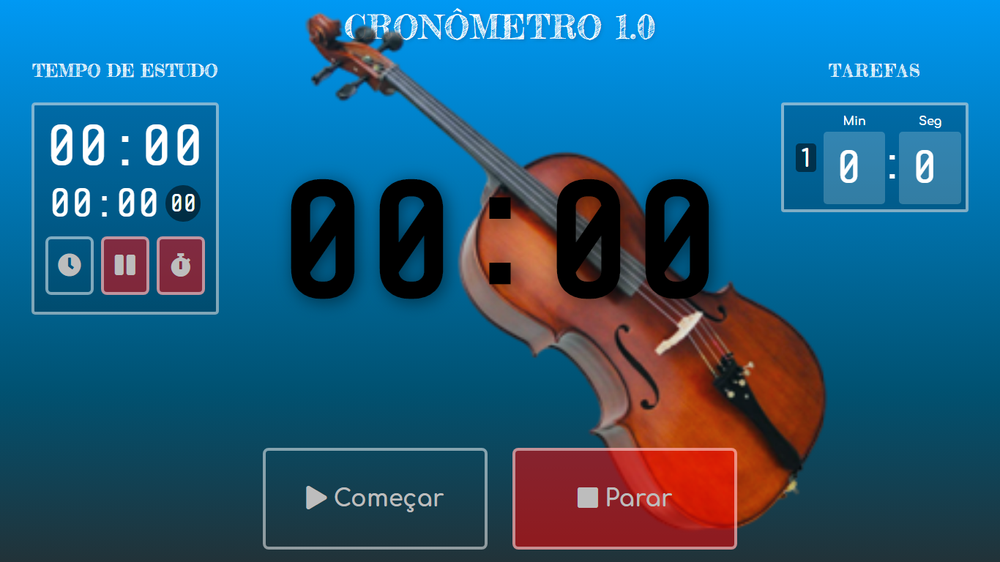

# :musical_note: Cronômetro para Estudo Musical

Este App tem por finalidade auxiliar nos estudos musicais.

A idéia surgiu a partir de uma necessidade nos meus estudos musicais, onde preciso cronometrar o tempo de execução de alguns exercícios do método de violoncelo.

E como o meu celular já estava com um metrónomo, precisava de uma outra solução.

Dessa necessidade surgiu esse Cronometro para estudo personalizado.

Onde nessa primeira versão informamos em tarefas o minutos e segundos para o execução dos exercícios do método.

## :clipboard: Como Usar

Ao lado esquerdo temos as tarefas, que consiste nada mais em informar o(s) minutos e o(s) segundos para o cronômetro e clique em "**Começar**", se desejar parar o cronômetro clique em "**Parar**".

## :watch: Calculando o Tempo Total de Estudo

Ao lado direito temos o horário que iniciamos o estudo. Ao clicar em "**Iniciar**"  o App começa a marcar o tempo total de estudos em minutos e segundos.

> Histórico de Atualizações

**Versões**

- [x] 1.0 - Projeto base.
- [x] 1.1 - Adição de botão de Stop no tempo Total de Estudo.

*Criada em 21.06.2020 por Sidnei Monteiro*

